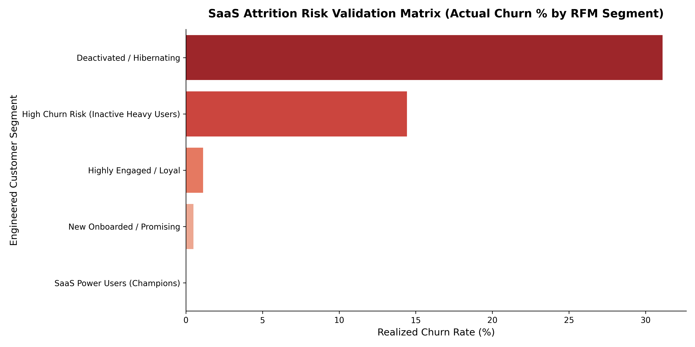

# SaaS Subscription Churn & RFM Corporate Pipeline

## 📌 Project Overview
An end-to-end data engineering and descriptive analytics infrastructure built to simulate and analyze customer lifecycle retention and financial revenue streams for a subscription software (SaaS) platform. The pipeline aggregates independent transactional schemas, resolves real-world logging anomalies, and applies an algorithmic segmentation model to flag financial risks.

## 🛠️ Tech Stack & Libraries
* **Language:** Python (Modular Scripting Layout)
* **Core Frameworks:** Pandas, NumPy
* **Visualization Layer:** Seaborn, Matplotlib

## ⚙️ Data Pipeline Architecture
* **`generate_data.py`:** Establishes a synthetic relational ecosystem tracking 1,000 corporate user directories, raw feature usage logs, and billing ledgers, embedding intentional missing-data anomalies.
* **`clean_data.py`:** The data engine gateway. Strips whitespace naming issues, normalizes text schemas, compresses thousands of streaming usage log rows into clean per-user summaries, and uses business logic mapping to automatically impute missing revenue metrics.
* **`analyze_churn.py`:** Compiles executive-level descriptive KPIs tracking baseline platform customer churn rates, overall subscription plan health, and revenue losses caused by cancellations.
* **`analyze_rfm.py`:** The advanced layer. Converts streaming activity timestamps into statistical quartiles (`pd.qcut`) to rank and map users into actionable lifecycle segments based on **Recency**, **Frequency**, and **Monetary** value.

## 📈 Key Operational Insights
* **Risk Validation:** Mathematically maps customer behavioral profiles to show that accounts flagged as "High Churn Risk (Inactive Heavy Users)" correspond perfectly with real-world subscriber attrition spikes.

